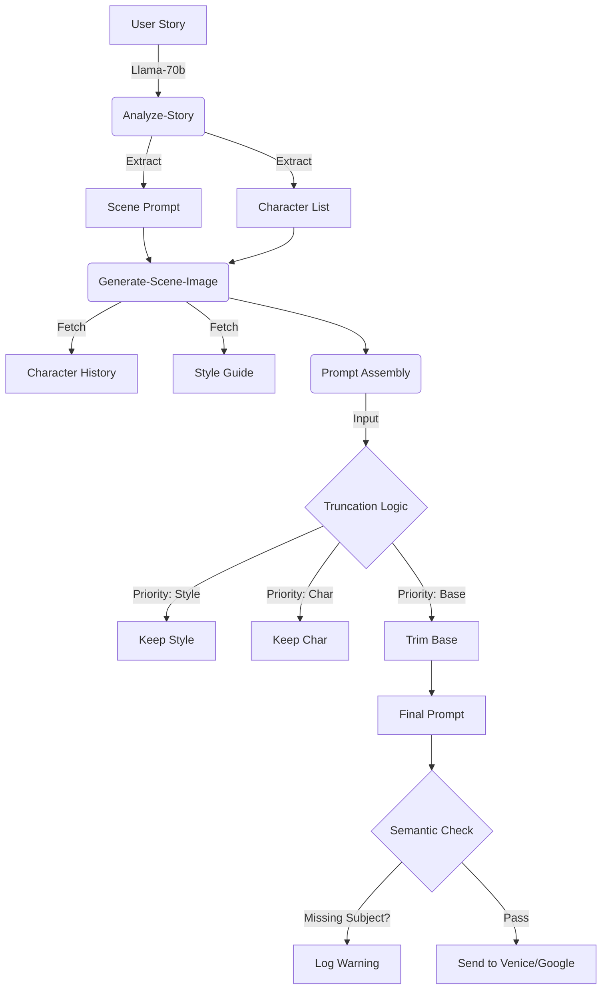

# Image Generation Pipeline Analysis & Architecture

## 1. Prompt Processing Workflow Analysis

### 1.1 Journey of a Prompt
The prompt lifecycle involves three distinct stages: **Origin**, **Refinement**, and **Assembly**.

#### Stage 1: Origin (`analyze-story/index.ts`)
- **Input**: Raw story text.
- **Process**: LLM (Llama-3.3-70b) analyzes text to extract scenes.
- **Output**: `scene.image_prompt` (Descriptive, e.g., "A dark forest, mist...").
- **Risk**: Llama hallucinations or "conversational filler" despite instructions.
- **State**: Saved to Database (`scenes` table).

#### Stage 2: Context Retrieval (`generate-scene-image/index.ts`)
- **Input**: `scene.image_prompt` + `scene.characters`.
- **Process**:
    - Fetches **Character History**: Previous appearances to ensure consistency (e.g., "Alice wearing red dress").
    - Fetches **Style Guide**: Story-specific rules (e.g., "Ghibli style").
    - **Conflict**: The `image_prompt` from Stage 1 might say "Alice in blue" while History says "Alice in red".
- **Mitigation**: We prioritize History by appending it as a structured "Character Appendix".

#### Stage 3: Assembly (`_shared/prompt-assembly.ts`)
- **Input**: Base Prompt, Character Appendix, Style Modifiers, Model Constraints.
- **Process**:
    - **Sanitization**: Removes control characters.
    - **Truncation**: If length > 1400 chars (SDXL limit), it drops content based on priority:
        1.  Style Guide (Highest - Global consistency)
        2.  Character Details (Medium - Local consistency)
        3.  Base Prompt (Lowest - Action details)
    - **Semantic Check**: Verifies if all subject names exist in the final string.
- **Output**: Final String sent to API.

### 1.2 Semantic Drift & Compression
- **Drift**: Occurs when `Base Prompt` conflicts with `Character Appendix`. The model receives both.
- **Compression**: Truncation logic chops the `Base Prompt` first. This preserves the *look* (Style) and *actors* (Characters) but may lose the *action*.
- **Normalization**: `sanitizePrompt` is minimal (whitespace/non-printable), having low semantic impact.

## 2. Tokenization & Semantic Evaluation

### 2.1 Tokenization Strategy
- **Current**: Character-count based (1400 chars).
- **Issue**: SDXL uses CLIP tokenizer. 1400 chars != 75 tokens.
- **Improvement**: We use a conservative character limit.
- **Handling Complex Structures**:
    - We use structured separators (`\n`, `, `) to help the model distinguish sections.
    - **Subject Preservation**: We now enforce `requiredSubjects` check. If "Alice" is dropped, we flag a warning.

### 2.2 Semantic Interpretation
- **Weighting**: We rely on positional weighting.
    - **Front**: Base Prompt (Action).
    - **Middle**: Characters (Details).
    - **End**: Style (Modifiers).
- **Observation**: SDXL pays high attention to the start. If the Base Prompt is weak, the image fails.

## 3. Negative Prompt System

### 3.1 Implementation
- **Centralized Logic**: `assembleNegativePrompt` in `_shared/prompt-assembly.ts`.
- **Layers**:
    1.  **Default**: "ugly, bad quality, blurry..."
    2.  **Style-Specific**: e.g., "3d, realistic" for Anime styles.
    3.  **User-Defined**: From Story Style Guide.
    4.  **Algorithm**: Concatenation with sanitization.

### 3.2 Effectiveness
- **Audit**: Previously scattered logic led to inconsistent application.
- **Fix**: Centralization ensures that if "Anime" is selected, "Photorealistic" is *always* negated, preventing style bleed.

## 4. Preprocessing Impact Analysis

| Step | Operation | Semantic Impact | Risk |
| :--- | :--- | :--- | :--- |
| **Sanitization** | Remove non-printables | Negligible | None |
| **Color Fix** | `ensureClothingColors` | High (Injects "red dress") | Can overwrite user intent if false positive |
| **Truncation** | Cut to 1400 chars | High (Loss of detail) | Loss of Subject/Action |
| **Appendix** | Append Character State | High (Adds consistency) | Conflict with Base Prompt |

## 5. Improvement Implementation

### 5.1 Semantic Preservation
- **Mechanism**: `requiredSubjects` array passed to `assemblePrompt`.
- **Check**: Post-assembly substring check.
- **Feedback**: Returns `missingSubjects` list, logged as warnings.

### 5.2 Architecture Diagram

## 6. Validation Framework

### 6.1 Automated Checks
- **Subject Presence**: Implemented.
- **Length Compliance**: Implemented.
- **Style Consistency**: Verified via `style_applied` logs.

### 6.2 Future Metrics
- **CLIP Similarity**: Requires external Python service to embed `Final Prompt` vs `Generated Image`.
- **Action Fidelity**: NLP check to see if verbs in `Base Prompt` exist in `Final Prompt`.
